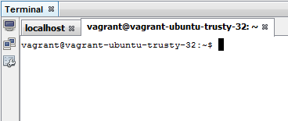
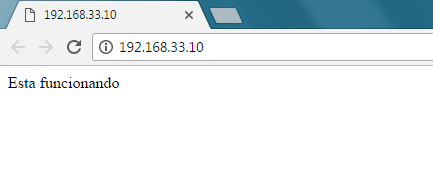

Veja a apresentação aqui: https://www.dropbox.com/sh/0xsrcro26apx01w/AAAb_5k3lzD5VyowBIWtW_p5a?dl=0

A apresentação será dividida em 3 partes:
1) Slide
2) Tutorial
3) Prática

**O que é o Vagrant?**

*Vagrant é uma ferramenta que permite a criação de um ambiente virtual
para rodar ambientes de desenvolvimento de projetos através da
integração com softwares como VirtualBox e VMWare(mais usados). O fim do
problema: "Mas no meu computador funciona...".*

**Por qual motivo devo usar o Vagrant?**

O Vagrant fornece a você as ferramentas para construir ambientes de
desenvolvimento únicos para cada projeto de uma vez, e depois facilmente
derrubá-los e reconstruí-los apenas quando eles forem necessários para
que você economize tempo e frustação.

O Vagrant dá para as equipes a possibilidade de garantir um ambiente
virtual de desenvolvimento consistente e portátil que seja fácil e
rápido de criar. Tal fato evita que diferentes usuários tenham as mesmas
configurações de sistema no desenvolvimento de um determinado projeto.

O Vagrant fornece a você as ferramentas para construir um ambiente de
desenvolvimento uma vez e depois distribuí-lo facilmente para os novos
membros da sua equipe de desenvolvimento.

**Outras ferramentas semelhantes:**

*Virtual Box*

É possível emular uma máquina para aplicações web usando somente o
VirtualBox, no entanto, todas as facilidades obtidas com o uso do
Vagrant serão perdidas, arquivos .iso são mais pesados que .box e a
máquina tem que ser configurada manualmente.

*CLI Tools*

"CLI Tools" vem de "Interface de linha de comando" e muitas pessoas
utilizam. A diferença do Vagrant é que ele utiliza dessas "tools",
realiza uma configuração simples de um arquivo automaticamente.

"Os utilitários de linha de comando fornecidos pelo software de
virtualização geralmente alteram cada versão ou possuem erros sutis com
soluções alternativas. O Vagrant detecta automaticamente a versão, usa
os sinalizadores corretos e pode solucionar problemas conhecidos. Então,
se você estiver usando uma versão do VirtualBox e um colega de trabalho
estiver usando uma versão diferente, o Vagrant ainda funcionará
consistentemente."

<https://www.vagrantup.com/intro/vs/cli-tools.html> - Link do trecho.
Acesso em 24/06/2017 12:38.

*Terraform*

Essa ferramenta possui aplicações muito parecidas com as do Vagrant.
Contudo, tal ferramenta tem foco no desenvolvimento de infraestrutura
que não trabalha em nível inferior ao Vagrant. Alguns recursos como
pastas sincronizadas e redes automáticas não têm no Terraform, este está
focado no gerenciamento de infra-estrutura e não em ambientes de
desenvolvimento.

"O uso primário do Terraform é para gerenciar recursos remotos em
provedores de nuvem, como o AWS. O Terraform foi projetado para
gerenciar infra-estruturas extremamente grandes que abrangem múltiplos
fornecedores de nuvem.Vagrant é projetado principalmente para ambientes
de desenvolvimento local que usam apenas um punhado de máquinas virtuais
no máximo."

https://www.vagrantup.com/intro/vs/terraform.html - Link do trecho.
Acesso em 24/06/2017 12:43.

**Do que preciso para usar?**

Para iniciar a configuração do Vagrant é preciso que alguns programas e
arquivos estejam instalados/baixados em sua máquina. São eles:

- O VirtualBox (https://www.virtualbox.org/);

- O NetBeans
(http://www.oracle.com/technetwork/pt/java/javase/downloads/jdk-netbeans-jsp-3413153-ptb.html);

- Uma “box” (facilmente encontrada no site http://www.vagrantbox.es/);

- O próprio Vagrant (https://www.vagrantup.com/).

**Tutorial:**

De maneira resumida, o tutorial apresenta-se bem simples, devido ao fato
de termos que apenas seguir alguns comandos. Contudo, isso não torna o
processo menos demorado.

Os testes foram realizados no Windows 7 e 10 utilizando o CMD. Caso
estiver usando outro SO, basta seguir os mesmos passos. Para instalar o
Vagrant aceitar os termos, próximo e finalizar. O mesmo ocorre na
instalação do VirtualBox e do NetBeans.

Primeiramente vamos criar uma pasta onde ficará armazenado nosso
projeto.

Vamos acessar o CMD do Windows através do comando win+r e ir para o
diretório da pasta. No nosso exemplo seria: cd C:\\ProjetoPHP .

Dentro dessa pasta vamos colocar nossa box. Nesse exemplo, utilizamos um
Ubuntu Server.

> 32 bits:
> https://cloud-images.ubuntu.com/vagrant/trusty/current/trusty-server-cloudimg-i386-vagrant-disk1.box
>
> 64 bits:
> https://cloud-images.ubuntu.com/vagrant/trusty/current/trusty-server-cloudimg-amd64-vagrant-disk1.box

É necessário adicionar essa box nos packages do Vagrant para que ele
possa enxergá-la como uma máquina virtual.

\$ vagrant box add nome\_da\_maquina arquivo.box

Precisamos criar o VagrantFile (arquivo que contém algumas configurações
da máquina) através do comando vagrant init. É importante que esse
comando seja realizado dentro do diretório do projeto.

Nesse arquivo, é necessário “descomentar” e alterar algumas linhas.

config.vm.box = “nome\_da\_sua\_box”

config.vm.network “private\_network” torna o processo mais seguro, uma
vez que, ao utilizar o public\_network, estaríamos pegando um servidor
disponível do seu roteador.

Compartilhamento de pastas. É necessário criar uma pasta chamada “www”
para que qualquer alteração nela seja espelhada na pasta “/var/www”,
criada pelo apache em nossa VM.

Salve o arquivo.

Com tudo configurado, vamos iniciar a máquina com o comando vagrant up.
Se não houver nenhum erro, podemos prosseguir para a próxima etapa.

O que temos é uma máquina pura, sem o PHP e o Apache por exemplo. Sendo
assim, será necessário instalar essas aplicações via ssh. Para tal,
podemos utilizar o Putty ou o próprio NetBeans que já vem com um
terminal embutido.

Clique no segundo ícone.

O usuário e senha da máquina, por padrão, são “vagrant”. A host é o ip
que configuramos e a porta é a 22 ssh.

Yes.

Se tudo deu certo, vamos ver uma tela como essa:

Agora vamos rodar alguns comandos:

- \$ sudo aptitude update

- \$ sudo aptitude install apache2

- \$ sudo aptitude install php5

- \$ sudo aptitude install mysql-server

Para acessar o mysql digite o seguinte comando e entre com a senha que
você criou durante a instalação:

- \$ mysql -u root -p

E realize as seguintes ações:

- \$ create database meustestes;

- ctrl + d (exit)

Agora podemos acessar nosso servidor via navegador através do IP.

Para alterar o conteúdo dessa página vamos usar a pasta compartilhada
www dentro do nosso projeto. Dentro dela tem outra pasta chamada html,
que funciona como a página htdocs do XAMPP.

Vamos criar um novo index.php

Edite com o seguinte código.

E recarregue a página do servidor.

Se digitarmos algum comando errado não aparecera erros. Para isso,
devemos ativar a opção display errors em nosso servidor.

- \$ sudo vim /etc/php5/apache2/php.ini

- \$ service apache2 reload

- \$ sudo service apache2 restart

Agora seus erros serão notificados no navegador.

Para usar o Mysql vamos instalar alguns pacotes através do comando:

- \$ sudo aptitude install php5-mysql

- \$ sudo service apache2 restart

Adicione o seguinte código em seu index.php :

Está tudo pronto.

Caso queira acessar seu servidor por outra forma que não seja o IP,
podemos configurar isso no próprio Windows. Vá no seguinte diretório e
edite o arquivo hosts:

Adicione o IP da máquina e seu novo endereço, salve o arquivo e
recarregue a página.

Pronto. Tudo configurado.
